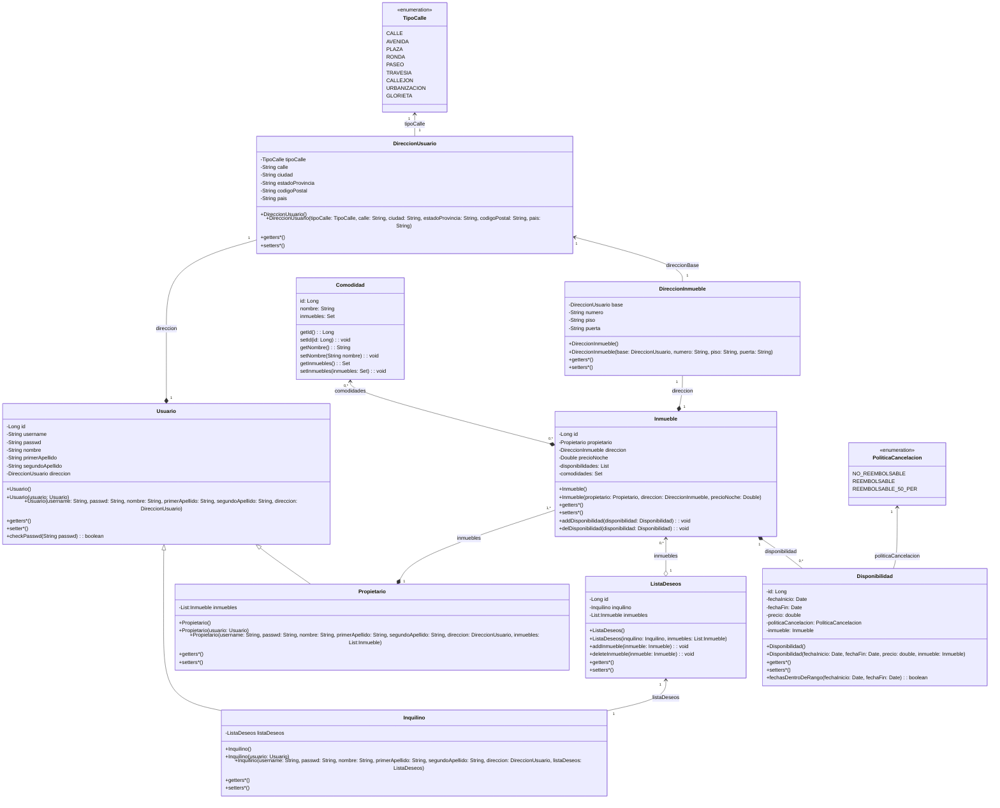
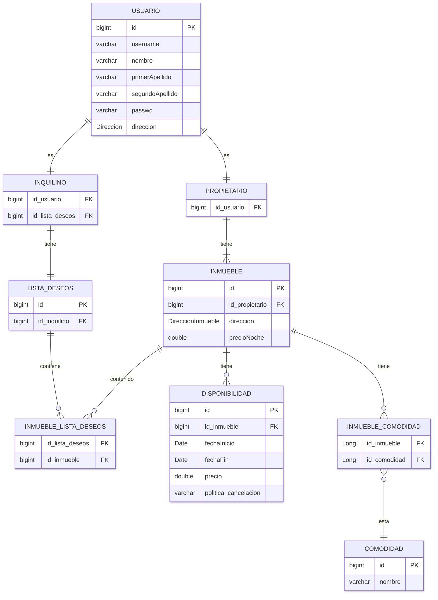

# BCKROOM
Aplicación web tipo Airbnb donde personas particulares pueden reservar alojamientos de propietarios particulares.

## Visualización de la Documentación
La documentación se ha elegido realizar en LaTeX para el mejor mantenimiento de la misma. Para generación del pdf se puede elegir una herramienta online como [Overleaf](https://www.overleaf.com) o en una máquina en local utilizando VSCode.

### Instalación de LaTeX
Para utilizarlo en local hay que seguir los siguientes pasos:

1. Instalar un compilador de LaTeX. Para Windows [Miktex](https://miktex.org/), para Linux instalar el paquete ```sudo apt install texlive-full```.
2. Instalar extensión en VSCode ```LaTeX Workshop```.
3. Instalar [Strawberry Perl](https://strawberryperl.com) para que pueda compilar los archivos de LaTeX.

### Visualización en local
Una vez realizado el proceso de instalación de LaTeX en local lo único que hay que hacer es la combinación de teclas ```Ctrl+Alt+B``` para hacer el build del código LaTeX y la combinación ```Ctrl+Alt+V``` para poder visualizar el PDF resultante en pantalla dividida.

## Despliegue del Sistema

Para poder desplegar el sistema debes moverte a la carpeta donde este el archivo ```pom.xml``` y por línea de comandos realizar el comando ```mvn spring-boot:run```.

## Tecnologías Usadas

Las tecnologías usadas en este proyecto son las siguientes:

 - Apache Maven (v3.9.11).
 - Spring Boot.
 - Apache Derby.
 - Bootstrap (latest v5.3).

## Diseño de la aplicación

En esta sección se indicarán y enseñarán los distintos tipos de diseños utilizados en el proyecto para facilitar la compresión del código y la relación de los distintos componentes en distintos niveles.

### Diseño de Clases

Al usar Java para realizar el proyecto se utilizará el paradigma POO, para facilitar la realización del código y su comprensión se ha realizado el diagrama de clases del dominio de la aplicación.


### Diseño de la Base de Datos

Para poder guardar datos persistentes en el sistema se va a utilizar una base de datos relacional, en el caso de este proyecto, al ser pequeño, se utilizará Apache Derby, y para controlar la persistencia y la creación de tablas y sus columnas se utilizará Spring JPA. Para poder saber que se guarda y como es necesario diseñar la base de datos y las relaciones entre las distintas tablas de esta.

