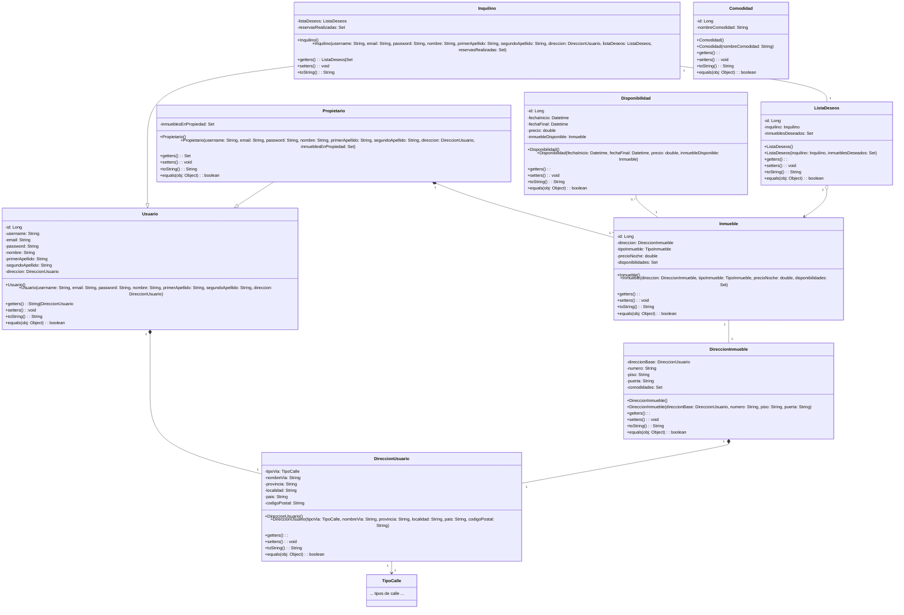

# Modelo

En esta carpeta se guarda el modelo de la aplicación web. Aquí se encuentra la lógica de negocio de la aplicación, es lo que tiene la información que se podrá mostrar en la vista.

## ```DireccionUsuario```

Esta clase representa la dirección de un usuario. Solo tiene el tipo de vía que és, el nombre de la calle, la provincia, localidad,país y código postal.

## ```DireccionInmueble```

Esta clase representa la dirección de un inmueble. Esta clase tiene contenida una dirección de usuario, número, piso y puerta.

## ```Usuario```

Esta clase representa a un usuario cualquiera. Esta clase contiene el nombre de usuario, correo electrónico, contraseña, nombre, apellidos, dirección del usuario y la dirección.

## ```Inquilino```

Esta clase es una especialización de usuario. Este tipo de usuario tiene una lista de inmuebles deseados y un conjunto de reservas que ha realizado el usuario.

## ```Propietario```

Esta clase es una especialización de usuario. Este tipo de usuario tiene un conjunto de inmuebles que le pertenecen.

## ```Inmueble```

Esta clase representa un inmueble. Contiene la direción del inmueble, el tipo de inmueble que és, el precio por noche y un conjunto de disponibilidades.

## ```Disponibilidad```

Esta clase representa una disponibilidad de un inmueble. Contiene las fechas de inicio y fin, el precio de la disponibilidad y el inmueble al que pertenece la disponibilidad.

## ```ListaDeseos```

Esta clase representa una lista de deseos de un inquilino. Contiene un conjunto de inmuebles que el inquilino ha marcado como deseados.

## ```TipoCalle```

Esta clase enumerada representan el tipo de vía que puede ser una una calle de una dirección. Esto con la intención de que no haya datos incorrectos en el sistema.

## ```Comodidad```

Esta clase representa una comodidad de un inmueble. Esta clase se realiza con la intención de poder guardar en la persistencia las comodidades para no modificar ninguna lógica al insertar nuevas comodidades.

## Diagrama de Clases

